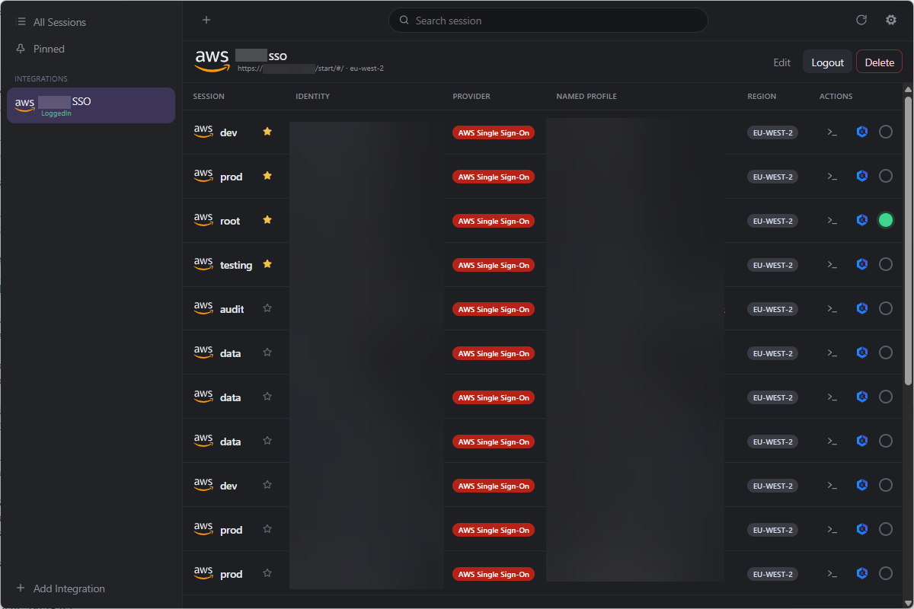
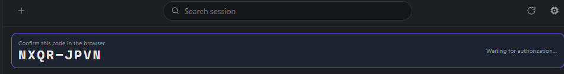
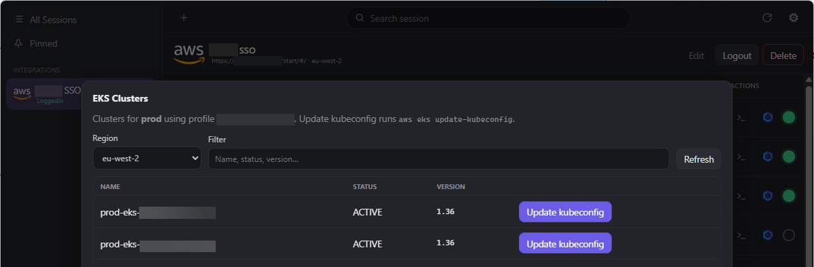
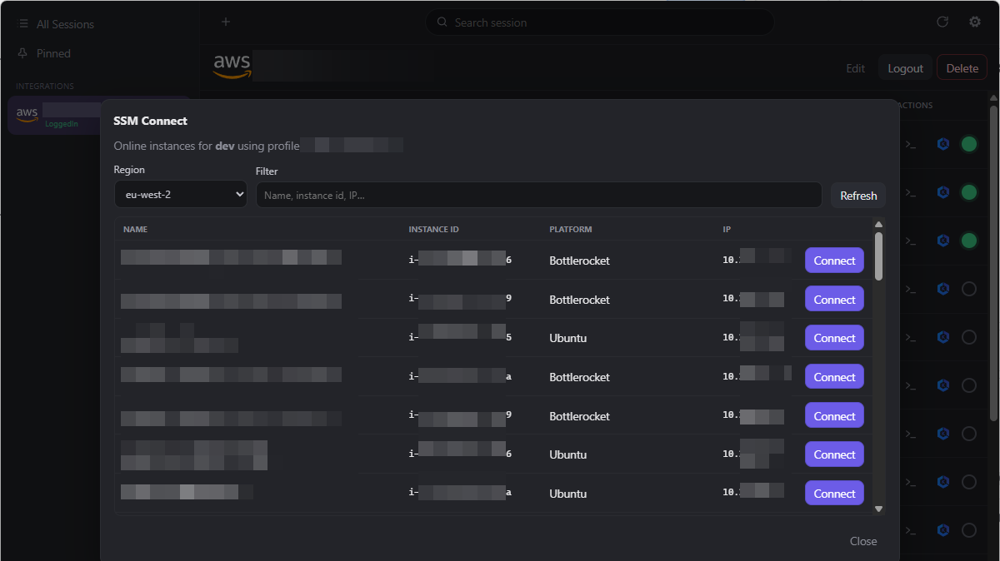

# AWS Session Manager (sessman)

Desktop app for AWS IAM Identity Centre (SSO) sessions with named profiles.

Inspired by [Leapp](https://github.com/noovolari/leapp); Go + [Wails](https://wails.io/) implementation.

Will it run on Linux / Mac; erm well... probably. I don't have a Mac so YMMV but wails seems to think it will.
Linux needs to be newish. I've not tested it yet out of laziness.

You still need to install

* AWS CLI v2 <https://docs.aws.amazon.com/cli/latest/userguide/getting-started-install.html>
* SessionManager <https://docs.aws.amazon.com/systems-manager/latest/userguide/session-manager-working-with-install-plugin.html>

Why did I bother to make this? Leapp uses a gig of ram while the "functionality" is basically a wrapper around
existing AWS tools. Sod that.
I started this a while back to mess with wails and it's been floating around on my sync drive without a git repo.
It stays somewhere in the realms of a similar UI but I added a kube config update as well as SSM.



Auth will provide the code in the UI to match the one in the AWS Identity screen 








## Dev Requirements

- Go 1.25+
- Node.js 24+
- [Wails CLI v2](https://wails.io/docs/gettingstarted/installation): `go install github.com/wailsapp/wails/v2/cmd/wails@latest`
- Developed in GoLand but you can use vscode, vi, notepad, its go it doesn't care.

## Develop

```bash
wails dev # Can't not like this feature in wails, it just works
```

## Build

```bash
# Current OS/arch
wails build

# Explicit platforms (must build on that OS, or use CI/WSL for Linux)
wails build -platform windows/amd64
wails build -platform darwin/universal
wails build -platform linux/amd64 -tags webkit2_41
```

Linux needs GTK3 + WebKit2GTK (ABI 4.1 on modern distros). Example on Debian/Ubuntu 22.04+:

```bash
# This seems to vary by distro which is somewhere between annoying and exhausting.
sudo apt install build-essential libgtk-3-dev libwebkit2gtk-4.1-dev
```

A FreeDesktop entry lives at [`build/linux/sessman.desktop`](build/linux/sessman.desktop).

## Usage

1. Add an SSO integration (start URL + SSO region).
2. Click **Login** and complete browser authorization.
3. Start a session to write temporary credentials to `~/.aws/credentials` under the session's profile name.
4. Use the AWS CLI/SDK with `--profile <name>`.

Workspace metadata lives under the OS config directory

* `%APPDATA%/.aws` on Windows
* `~/Library/Application Support/.aws` on macOS possibly, someone file a ticket if it isn't.
* `~/.config/.aws` on Linux

If you're on Windows and using WSL just create a symlink in WSL (ubuntu I guess) to `%APPDATA%/.aws` so that the AWS CLI can find the credentials.

SSO secrets are AES-GCM encrypted in `secrets/`; the master key is stored in the OS credential store (Cred Manager / Keychain / Secret Service).
